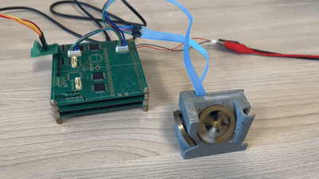

# Reactional wheel controller

Программное обеспечение для контроля работы маховика в составе блока маховиков.

**Функции:**
- Задание требуемой скорости вращения маховика
- Обеспечение изменения скорости маховика с заданным угловым ускорением
- Отслеживание реальной скорости вращения маховика

## Сборка проекта
Проект создан под стандартную сборку через cmake.

**Требования**
Необходимо наличие тулчейна `arm-none-eabi-`.

## Испытания

